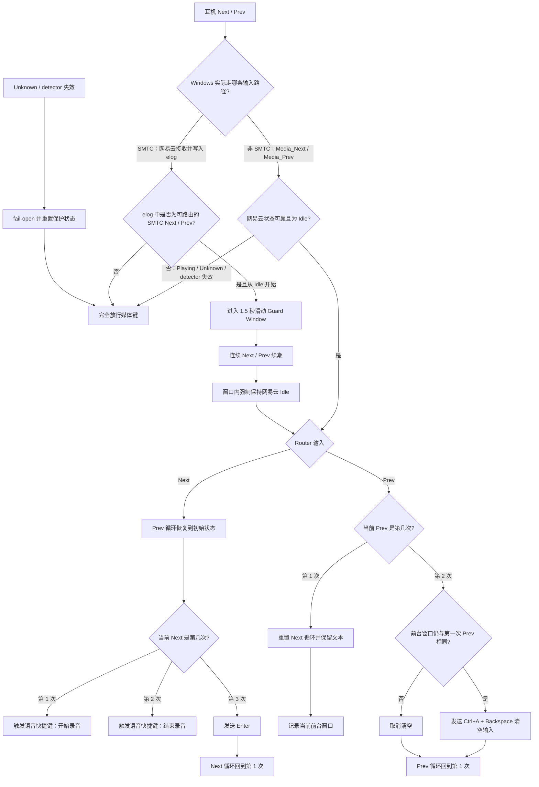

# TWS Media Router

> **网易云音乐专属。** 当前实现、状态检测和 SMTC 兼容逻辑均以 Windows 版网易云音乐桌面客户端为目标并完成实机验证。

把 TWS 耳机上“音乐停止后基本没用”的上一首、下一首按钮，变成语音输入、发送和删除按钮。

## 它解决什么问题

很多 TWS 耳机自带 `Media_Next` 和 `Media_Prev` 控制键：播放音乐时它们用于切歌，但音乐暂停或停止后通常没有实际作用。

TWS Media Router 会判断网易云音乐当前是否正在播放，并选择性接管这两个按键：

- `Playing`：完全放行，耳机继续正常控制上一首/下一首。
- `Idle`：接管媒体键，用于语音输入、发送和删除。
- `Unknown`：无法可靠判断时完全放行，避免误吞媒体键。

### 推荐运行模式

**优先使用网易云音乐关闭 SMTC 的直接媒体键模式。** 这是项目的主路径，也是当前延迟最低、行为最确定的模式：

```text
耳机 Next / Prev
→ Windows Media_Next / Media_Prev
→ AutoHotkey 直接接管
→ Router 动作
```

如果网易云音乐开启 SMTC，Windows 可能会把耳机媒体控制直接交给网易云，AHK 不再收到 `Media_Next / Media_Prev`。此时项目会自动使用网易云 `cloudmusic.elog` 中的 SMTC 事件作为兼容输入，并在短暂的 Guard Window 内恢复歌曲、强制保持暂停状态，再执行 Router 动作。

SMTC 模式属于 **best-effort 兼容路径**。它依赖 elog 事件，因此天然比直接媒体键路径多一层检测延迟；快速、混合的连续操作也比非 SMTC 模式更复杂。项目不会为了启用兼容模式去读取或修改网易云的 SMTC 配置，而是根据实际出现的输入事件自动选择路径。

推荐优先级：

1. **非 SMTC：直接媒体键路径，推荐。**
2. **SMTC：elog + Guard Window 兼容路径，可用但延迟更高。**

默认动作：

- 连续按 `Media_Next`：语音输入 → 语音输入 → Enter 发送，然后循环。
- 第一次按 `Media_Prev`：重置 Next 循环，保留已输入文本，并记录当前前台窗口。
- 第二次按 `Media_Prev`：只有前台窗口仍与第一次相同时才发送 `Ctrl+A`、Backspace；如果焦点已切到其他窗口，则取消清空并重置 Prev 循环。

### 当前按键流程



脚本不会主动激活或聚焦任何窗口。使用时请让目标输入框保持焦点。

## 播放状态来源

本项目当前以 **网易云音乐** 为目标：

- `netease`（默认、推荐）：读取网易云音乐 `cloudmusic.elog`，也是 SMTC 兼容路径所依赖的状态和事件来源。
- `gsmtc`：保留为系统媒体会话状态来源，需要 Windows 10 1809 或更高版本；它不是当前网易云专属 SMTC 按键兼容逻辑的主路径。

无法读取、没有可靠状态、detector 退出，或者超过 `stale_after_ms` 没有收到 detector 新鲜度信号时，媒体键都会保持原功能。

## 环境要求

- Windows
- Node.js 20.6 或更高版本
- AutoHotkey v2
- 使用 `netease` 时需要网易云音乐桌面客户端及其 `cloudmusic.elog`

仓库不包含 Node.js 或 AutoHotkey 安装包。可以手动安装，也可以把下面的提示词交给目标环境中的 agent，让它完成克隆、依赖检查、构建和配置。

## 手动安装

```powershell
git clone https://github.com/qy4747/tws-media-router.git
cd tws-media-router
npm install
npm run build
```

然后运行：

```text
automation\tws-media-router.ahk
```

如果系统询问使用哪个 AutoHotkey 版本，请选择 v2。

## 配置

所有个性化设置都在 [`config/router.ini`](config/router.ini)：

- 播放状态来源：`netease` 或 `gsmtc`
- detector 轮询与失效超时
- SMTC Guard Window 的空闲结束时间
- 语音/转录软件的全局快捷键
- 清空输入框使用的按键

`config/router.ini` 中 `[transcription_shortcut]` 的 `press`、`release` 和 `hold_ms` 必须与转录软件里设置的“开始/结束录制”全局快捷键一致。仓库中的 `Left Ctrl + Left Alt + Up` 只是当前验证过的默认配置；如果转录软件使用其他快捷键，就把这里改成同一组按键。

修改配置后退出并重新运行 AHK 脚本即可。修改 TypeScript 源码后还需要先运行 `npm run build`。


## SMTC 延迟诊断

如果 SMTC 模式下出现第二次 Next 较慢、补偿时序异常或快速混合操作不稳定，可以使用仓库自带的诊断脚本记录 ELOG 与 AHK 两侧的毫秒级时间线：

```powershell
powershell -ExecutionPolicy Bypass -File .\diagnostics\collect-smtc-latency.ps1
```

复现完成后按 Enter，结果会写入：

```text
diagnostics\captures\<时间>\
├─ merged.log
└─ metadata.txt
```

`merged.log` 会合并 SMTC/ELOG 状态、Router 决策、补偿按键、语音快捷键和 Enter 等事件，适合直接交给 coding agent 分析延迟和事件冲突。

## 给 agent 的安装与适配提示词

复制下面这段文字到需要安装本项目的 Windows 环境中的 coding agent：

```text
请在这台 Windows 电脑上安装并配置 TWS Media Router：
https://github.com/qy4747/tws-media-router

要求：
1. 将仓库克隆到一个新的独立目录，不要覆盖其他项目。
2. 先阅读仓库中的 README.md、AGENTS.md 和 config/router.ini。
3. 检查 Node.js 20.6+ 与 AutoHotkey v2 是否可用；缺少时从官方来源安装。不要下载或使用 AutoHotkey v1。
4. 运行 npm install 和 npm test。
5. 本项目按网易云音乐环境配置，player.provider 优先使用 netease。优先关闭网易云 SMTC，使用 AHK 直接媒体键路径；只有确实需要网易云 SMTC 时才使用 elog 兼容路径。
6. 检查我使用的转录软件，并确认它用于开始/结束录制的全局快捷键。在转录软件和 config/router.ini 的 [transcription_shortcut] press/release 中设置完全相同的按键；不要假定必须是 Left Ctrl + Left Alt + Up，也不要把软件名称硬编码进代码。
7. 保持默认媒体键语义：Playing 时完全放行；Idle 时接管；Unknown、detector 退出或状态过期时必须 fail-open。不要添加窗口自动聚焦。
8. 保持默认操作节奏：连续两次 Next 分别触发录制开始和录制结束，第三次 Next 发送 Enter；Prev 第一次重置该循环并保留文字，第二次只有仍处于同一前台窗口时才清空输入框。除非我明确要求，否则不要改变。
9. 创建当前用户级 Windows 开机启动项，在我登录 Windows 后自动启动 automation\\tws-media-router.ahk。优先使用当前用户 Startup 文件夹中的快捷方式，并确保它调用 AutoHotkey v2；不要要求管理员权限。
10. 完成后告诉我配置文件位置、启动项位置、手动启动方法和一套实机验证步骤。不要在当前会话中启动会抢占按键的 AHK 实例，等我确认后再启动。
```

如果未来需要用声音电平判断播放状态，可让 agent 参考 `router.ini` 中被注释的 `[audio_level]` 提示；当前版本不会执行这部分逻辑。

## 开源与第三方代码

项目使用 MIT License。网易云 elog 解码与检测思路参考 Coooookies/netease-cloudmusic-detector，详情见 [`THIRD_PARTY_NOTICES.md`](THIRD_PARTY_NOTICES.md)。
